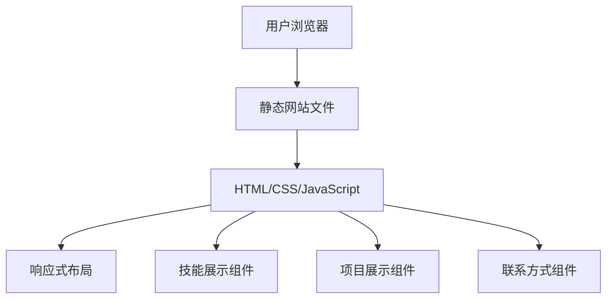

## 1. Architecture Design

## 2. Technology Description
- Frontend: 纯静态HTML + CSS + JavaScript
- 样式框架: Tailwind CSS v3
- 图标库: Lucide Icons
- 构建工具: 无（纯静态文件）
- 响应式设计: 使用Tailwind的响应式类

## 3. Route Definitions
| 路由 | 用途 |
|------|------|
| / | 首页，包含所有内容模块 |

## 4. API Definitions
- 不适用，本项目为纯静态网站，不需要API调用

## 5. Server Architecture Diagram
- 不适用，本项目为纯静态网站，不需要服务器架构

## 6. Data Model
- 不适用，本项目为纯静态网站，不需要数据模型