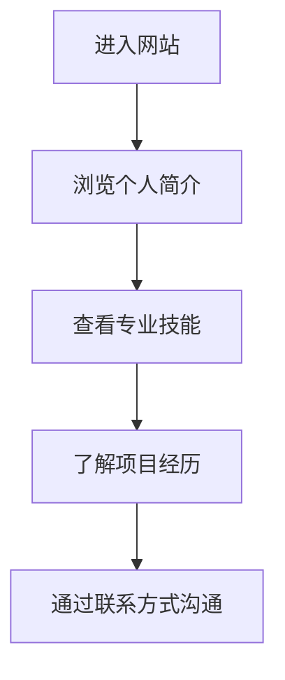

## 1. Product Overview
个人介绍网站，展示王嘉铭的专业技能、教育背景和项目经历，专注于商务数据分析领域。
- 目标用户为潜在雇主、同学和行业专业人士，展示个人专业能力和项目经验。
- 提供一个简洁、专业的在线形象，突出数据分析技能和相关成果。

## 2. Core Features

### 2.1 User Roles
| 角色 | 访问方式 | 核心权限 |
|------|----------|----------|
| 访客 | 直接访问 | 浏览所有内容 |

### 2.2 Feature Module
1. **首页**：个人简介、专业技能展示、项目经历、联系方式

### 2.3 Page Details
| 页面名称 | 模块名称 | 功能描述 |
|---------|----------|----------|
| 首页 | 个人简介 | 展示姓名、专业、学校信息，以及个人职业目标和专业领域 |
| 首页 | 专业技能 | 以可视化方式展示数据分析、数据挖掘、商业智能等核心技能 |
| 首页 | 项目经历 | 展示相关项目经验，包括项目描述、使用的工具和技术、项目成果 |
| 首页 | 联系方式 | 提供邮箱、LinkedIn等联系方式 |

## 3. Core Process
访客进入网站 → 浏览个人简介 → 查看专业技能 → 了解项目经历 → 通过联系方式进行沟通

## 4. User Interface Design
### 4.1 Design Style
- 主色调：蓝色 (#165DFF) 和白色 (#FFFFFF)，辅以浅灰色 (#F5F7FA) 作为背景
- 按钮样式：圆角矩形，有轻微的阴影效果
- 字体：主要使用无衬线字体，标题使用较大字号和粗体
- 布局风格：卡片式布局，整洁有序，强调内容的层次感
- 图标风格：简约现代的线性图标

### 4.2 Page Design Overview
| 页面名称 | 模块名称 | UI元素 |
|---------|----------|--------|
| 首页 | 个人简介 | 大型标题展示姓名，副标题展示专业和学校，简洁的个人描述，背景使用渐变效果 |
| 首页 | 专业技能 | 使用进度条或雷达图展示技能水平，按类别分组，每个技能配有相关图标 |
| 首页 | 项目经历 | 卡片式布局，每个项目包含标题、描述、使用的技术栈和成果，带有轻微的悬停效果 |
| 首页 | 联系方式 | 简洁的联系信息列表，包含邮箱、LinkedIn等，配有相应的图标 |

### 4.3 Responsiveness
- 设计采用响应式布局，优先考虑桌面端体验，同时适配平板和移动设备
- 在小屏幕设备上，布局会自动调整为垂直堆叠，确保内容可读性
- 触摸设备上的交互元素会适当增大，提高可点击性

### 4.4 3D Scene Guidance
- 不适用，本项目为纯静态网站，不需要3D场景